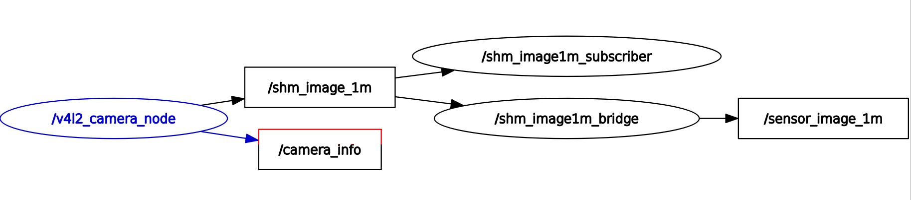

# github repo of v4l2_camera with zero-copy support

this is not the official repo of ros2_v4l2_camera, please goto [the gitlab](https://gitlab.com/boldhearts/ros2_v4l2_camera)

## introduction

in this repo, the camera node can publish `shm_msgs::msg::Imagexm` based on [ros2_shm_msgs](https://github.com/ZhenshengLee/ros2_shm_msgs)

With shm_msgs msg types, zero copy(during the IPC communication period) can be achieved, and transport latency and cpu usage can be reduced.

You must select the msg type according the size of data, for example, `shm_msgs::msg::Image1m` for the `640X480 RBG8` image transport.

This is because in most of ddses, the constraints of zero-copy transport is the bounded size of data.

## usage of zero-copy transport

### select rmw

the dds config files canbe checked in [ros2_shm_msgs](https://github.com/ZhenshengLee/ros2_shm_msgs)

for rmw_cyclonedds

```sh
export RMW_IMPLEMENTATION=rmw_cyclonedds_cpp
export CYCLONEDDS_URI=file:///$HOME/shm_cyclonedds.xml

# t0
iox-roudi
```

for rmw_fastrtps_cpp

```sh
export RMW_IMPLEMENTATION=rmw_fastrtps_cpp
export FASTRTPS_DEFAULT_PROFILES_FILE=$HOME/shm_fastdds.xml
export RMW_FASTRTPS_USE_QOS_FROM_XML=1
```

### build

```sh
cd src
git clone https://github.com/ZhenshengLee/ros2_shm_msgs.git
# the added work of zero-copy support is hosted in the `outdoor/rolling` branch.
git clone -b outdoor/rolling https://github.com/ZhenshengLee/ros2_v4l2_camera.git
colcon build
```

### run

driver(after a camera pluged in, in my case that's a logitech525 usbcam)

```sh
ros2 run v4l2_camera v4l2_camera_shm1m_node --ros-args --log-level info
# ros2 run v4l2_camera v4l2_camera_shm1m_node --ros-args --log-level debug
```

image1m_subscriber

```sh
cd install/v4l2_camera/lib/v4l2_camera
./v4l2_camera_image1m_subscriber

[INFO] [1654154565.559710174] [shm_image1m_subscriber]: Received...
[INFO] [1654154565.559730953] [shm_image1m_subscriber]: get-image1m-transport-time: 0.253
```

image1m_rviz_bridge

```sh
# config topic remapping
ros2 launch v4l2_camera shm_image1m_bridge.launch.py
```

rviz2

```sh
rviz2
# add topic of image
```

see rqt_graph 

### performance

run normal(basically shm) image tranport

```sh
# t1
ros2 run v4l2_camera v4l2_camera_node --ros-args --log-level info
# ros2 run v4l2_camera v4l2_camera_node --ros-args --log-level debug

# t2
cd install/v4l2_camera/lib/v4l2_camera
./v4l2_camera_image_subscriber
```

in my pc of dell 3630, the zero-copy transport of a shm_msgs::msg::Image1m can save about 80% of transport time, from 1.4ms to 0.3ms

# v4l2_camera

A ROS 2 camera driver using Video4Linux2 (V4L2).

## Features

* Lists and exposes all user-settable controls of your camera as ROS 2
  parameters.
* Uses `cv_bridge` to convert raw frames to ROS 2 messages, so
  supports a wide range of encoding conversions.
* Supports `image_transport` to enable compression.
* Supports composing the camera node and using ROS 2 intra-process
  commmunication with zero-copy messaging.

## Installation
[This article](https://medium.com/swlh/raspberry-pi-ros-2-camera-eef8f8b94304)
details how to build and run this package. It focuses on Raspberry Pi
OS with the Raspberry Pi Camera Module V2 but should generalise for
most systems.

### ROS package install
This package is available from the ROS package repositories and can
therefore be installed with the following command and your ROS version
name:

```shell
sudo apt-get install ros-${ROS_DISTRO}-v4l2-camera
```

### Building from source
If you need to modify the code or ensure that you have the latest
updates you will need to clone this repository, and then build the
package.

```shell
git clone --branch ${ROS_DISTRO} https://gitlab.com/boldhearts/ros2_v4l2_camera.git src/v4l2_camera
rosdep install --from-paths src/v4l2_camera --ignore-src -r -y
colcon build
```

Most users will also want to set up compressed transport using the
dependencies below.

### Basic Usage
Run the camera node to publish camera images, using the default
parameters:

```shell
ros2 run v4l2_camera v4l2_camera_node
```

You can use `rqt-image-view` to preview the images (open another terminal):

```shell
sudo apt-get install ros-${ROS_DISTRO}-rqt-image-view
ros2 run rqt_image_view rqt_image_view
```

See further below for information about enabling compression.

## Nodes

### v4l2_camera_node

The `v4l2_camera_node` interfaces with standard V4L2 devices and
publishes images as `sensor_msgs/Image` messages.

#### Published Topics

* `/raw_image` - `sensor_msgs/Image`

    The image.

#### Parameters

* `video_device` - `string`, default: `"/dev/video0"`

    The device the camera is on.

* `pixel_format` - `string`, default: `"YUYV"`

    The pixel format to request from the camera. Must be a valid four
    character '[FOURCC](http://fourcc.org/)' code [supported by
    V4L2](https://linuxtv.org/downloads/v4l-dvb-apis/uapi/v4l/videodev.html)
    and by your camera. The node outputs the available formats
    supported by your camera when started.
    Currently supported: `"YUYV"` or `"GREY"`

* `output_encoding` - `string`, default: `"rgb8"`

    The encoding to use for the output image. Can be any supported by
    `cv_bridge` given the input pixel format. Currently these are for
    `"YUYV"`: `" yuv422_yuy2"` (no conversion), or `"mono8"`, `"rgb8"`,
    `"bgr8"`, `"rgba8"` and `"bgra8"`, plus their 16 bit variants, and for
    `"GREY"` these are `"mono8"` (no conversion), `"rgb8"`,
    `"bgr8"`, `"rgba8"` and `"bgra8"`, plus their 16 bit variants.

* `image_size` - `integer_array`, default: `[640, 480]`

    Width and height of the image.

* Camera Control Parameters

    Camera controls, such as brightness, contrast, white balance, etc,
    are automatically made available as parameters. The driver node
    enumerates all controls, and creates a parameter for each, with
    the corresponding value type. The parameter name is derived from
    the control name reported by the camera driver, made lower case,
    commas removed, and spaces replaced by underscores. So
    `Brightness` becomes `brightness`, and `White Balance, Automatic`
    becomes `white_balance_automatic`.

## Compressed Transport

This package uses `image_transport` to publish images and make
compression possible. However, by default it only supports raw
transfer, plugins are required to enable compression. These need to be
installed separately:

```shell
sudo apt-get install ros-${ROS_DISTRO}-image-transport-plugins
```

Once installed, they will be automatically used by the driver and
additional topics will be available, including
`/image_raw/compressed`.
